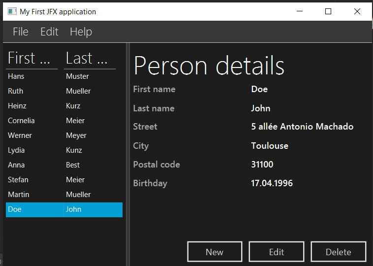

# My first javaFx application 

Following a *javaFx* tutorial that I found [here](https://code.makery.ch/fr/library/javafx-tutorial/),
I was able to reproduce the output of java complete software. This is what the app look like in 
a screenshot.

